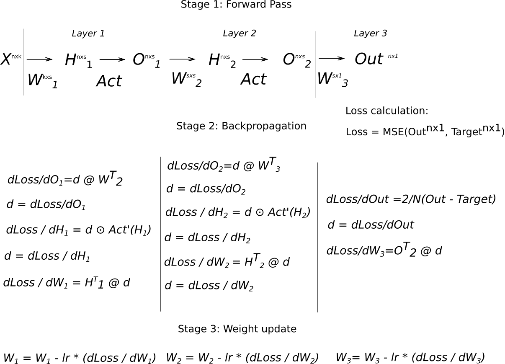
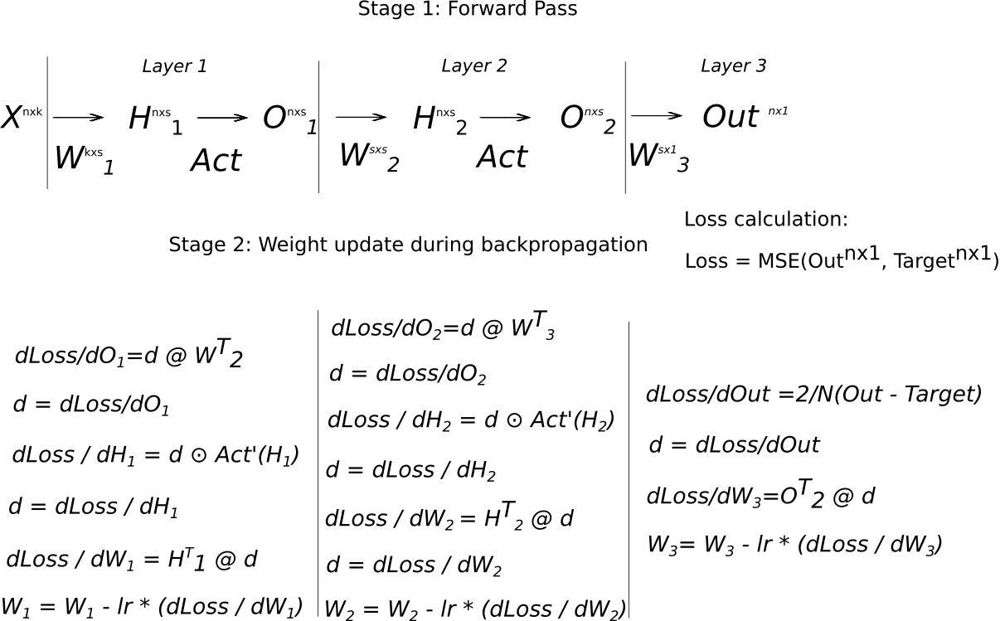

# Weight update during backpropagation

---

TL;DR: Weight update during backpropagation makes worse training. Depending on setup, online weight update gives neglectable improvement or impairs convergence.
#### For more details, pre-prepint: [PDF](assets/WeightsUpdateDuringBackprop.pdf)
---


### The conventional backpropagation and weights update approach:

### The proposed, online approach:


---
### Codebase
This repo contains torch custom ```Linear``` and ```BatchNorm1D``` implementations which perform a SGD step before forwarding gradient to the previous layer. So it allows to experiment with the [online setup](#the-proposed-online-approach). Subsequently, only the SGD optimizer is available - otherwise one should plug-in more sophisticated optimizers in the custom ```Linear``` and ```BatchNorm1D```.
Also the repo includes quick and dirty code to compare the online and the traditional approach. Both networks are initialized with the same weights and trained on the same batches.

MNIST, Fashion MNIST and CIFAR 10 are availabe as datasets.

Also one can tune probability with which an updated Weight matrix is used when forwarding gradient to the previous layer.


---
### Run:
```bash
python3 -m venv env;
source env/bin/activate;
python3 -m pip install -r requirements.txt;
# do not forget to do wandb init

# we use hydra config (the conf/ dir) to manage args
python3 main.py batch_sizes=[256] feature_pass=['triangle'] learning_rates=[0.0001] l2_lambda=[0.0] dataset_name=['MNIST']
```
### Tests:
```bash
python -m pytest -sv
```